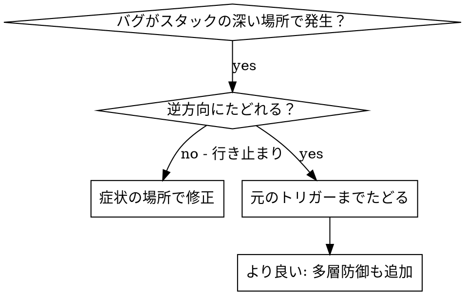
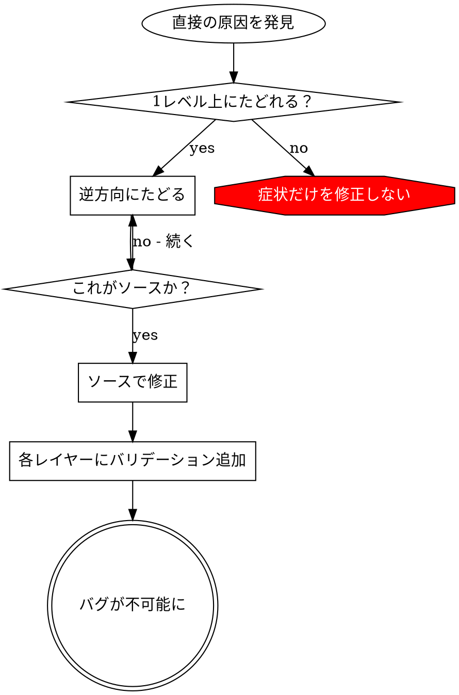

# ルートコーズトレーシング（根本原因追跡）

## 概要

バグはコールスタックの深い場所で発現することが多い（間違ったディレクトリでのgit init、間違った場所へのファイル作成、間違ったパスでのデータベースオープン）。エラーが表示される場所で修正しようとするのが本能だが、それは症状の対処に過ぎない。

**核心原則:** 元のトリガーを見つけるまでコールチェーンを逆方向にたどり、ソースで修正する。

## 使用タイミング



**使用する場面:**

- エラーが実行の深い場所で発生（エントリーポイントではない）
- スタックトレースが長いコールチェーンを示す
- 無効なデータがどこで発生したか不明
- どのテスト/コードが問題を引き起こしているか特定が必要

## トレーシングプロセス

### 1. 症状を観察

```
Error: git init failed in /Users/jesse/project/packages/core
```

### 2. 直接の原因を見つける

**どのコードがこれを直接引き起こしているか？**

```typescript
await execFileAsync('git', ['init'], { cwd: projectDir });
```

### 3. 問う: 何がこれを呼び出したか？

```typescript
WorktreeManager.createSessionWorktree(projectDir, sessionId)
  → called by Session.initializeWorkspace()
  → called by Session.create()
  → called by test at Project.create()
```

### 4. 上方向にたどり続ける

**どの値が渡されたか？**

- `projectDir = ''`（空文字列！）
- `cwd`としての空文字列は`process.cwd()`に解決される
- それがソースコードディレクトリ！

### 5. 元のトリガーを見つける

**空文字列はどこから来たか？**

```typescript
const context = setupCoreTest(); // Returns { tempDir: '' }
Project.create('name', context.tempDir); // beforeEachの前にアクセス！
```

## スタックトレースの追加

手動でたどれない場合、計装を追加:

```typescript
// 問題のある操作の前に
async function gitInit(directory: string) {
  const stack = new Error().stack;
  console.error('DEBUG git init:', {
    directory,
    cwd: process.cwd(),
    nodeEnv: process.env.NODE_ENV,
    stack,
  });

  await execFileAsync('git', ['init'], { cwd: directory });
}
```

**重要:** テストでは`console.error()`を使用（loggerではない - 表示されない可能性がある）

**実行してキャプチャ:**

```bash
npm test 2>&1 | grep 'DEBUG git init'
```

**スタックトレースを分析:**

- テストファイル名を探す
- 呼び出しをトリガーする行番号を見つける
- パターンを特定（同じテスト？同じパラメータ？）


## 実例: 空のprojectDir

**症状:** `.git`が`packages/core/`（ソースコード）に作成される

**トレースチェーン:**

1. `git init`が`process.cwd()`で実行される ← 空のcwdパラメータ
2. WorktreeManagerが空のprojectDirで呼び出される
3. Session.create()に空文字列が渡される
4. テストがbeforeEachの前に`context.tempDir`にアクセス
5. setupCoreTest()が初期状態で`{ tempDir: '' }`を返す

**根本原因:** トップレベル変数の初期化が空の値にアクセス

**修正:** tempDirをgetterにし、beforeEachの前にアクセスするとスローするように

**多層防御も追加:**

- Layer 1: Project.create()がディレクトリを検証
- Layer 2: WorkspaceManagerが空でないことを検証
- Layer 3: NODE_ENVガードがtmpdir外でのgit initを拒否
- Layer 4: git init前のスタックトレースログ

## 核心原則



**エラーが表示される場所だけを修正しない。** 逆方向にたどって元のトリガーを見つける。

## スタックトレースのヒント

**テスト内:** `console.error()`を使用、loggerではない - loggerは抑制されている可能性がある
**操作前:** 失敗した後ではなく、危険な操作の前にログ
**コンテキストを含める:** ディレクトリ、cwd、環境変数、タイムスタンプ
**スタックをキャプチャ:** `new Error().stack`で完全なコールチェーンを表示

## 実際のインパクト

デバッグセッション（2025-10-03）から:

- 5レベルのトレースで根本原因を発見
- ソースで修正（getterバリデーション）
- 4層の防御を追加
- 1847テストがパス、汚染ゼロ
