# Confluence用変換ルール

ConfluenceはMarkdownをサポートしているため、基本的にはMarkdown形式を維持。
ダイアグラムのみMermaid → PlantUML形式に変換する。

## 基本方針

| 要素           | 変換               |
| -------------- | ------------------ |
| 見出し         | そのまま維持       |
| テーブル       | そのまま維持       |
| コードブロック | そのまま維持       |
| リスト         | そのまま維持       |
| リンク         | そのまま維持       |
| **Mermaid**    | **PlantUMLに変換** |

## Mermaid → PlantUML 変換

### フローチャート

**Mermaid:**

````markdown
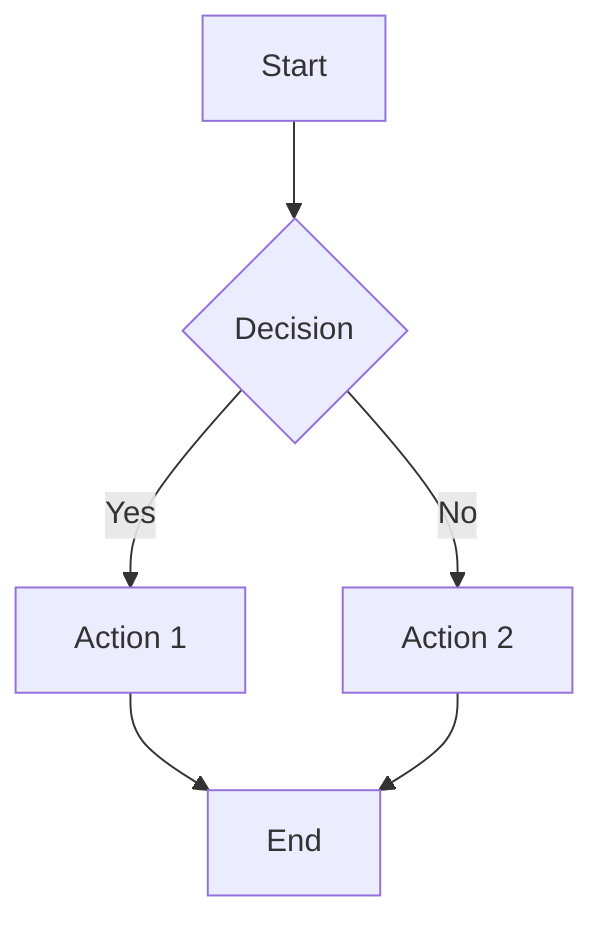
````

**PlantUML:**

````markdown
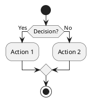
````

### シーケンス図

**Mermaid:**

````markdown
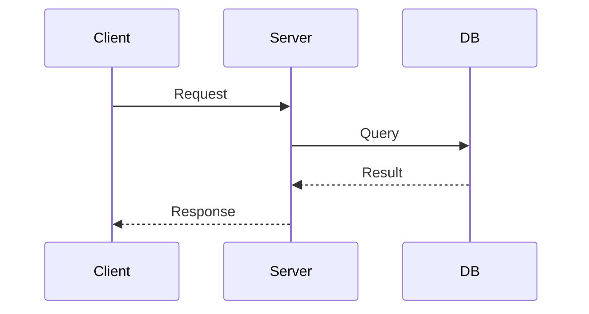
````

**PlantUML:**

````markdown
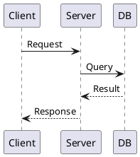
````

### クラス図

**Mermaid:**

````markdown
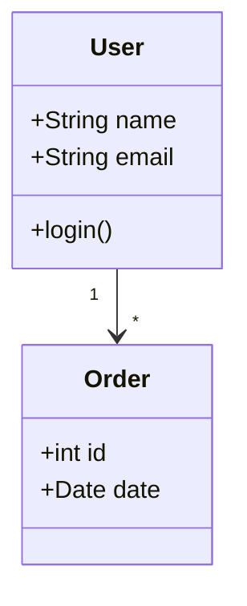
````

**PlantUML:**

````markdown
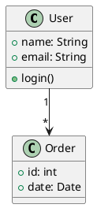
````

### ER図

**Mermaid:**

````markdown
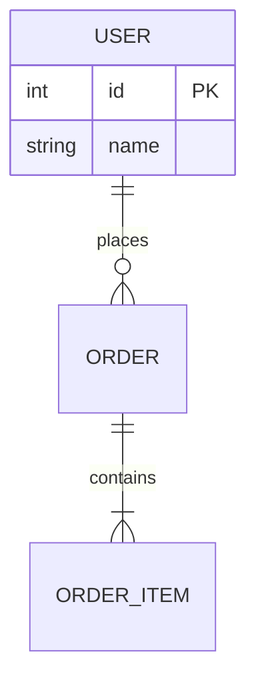
````

**PlantUML:**

````markdown
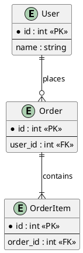
````

### コンポーネント図

**Mermaid:**

````markdown
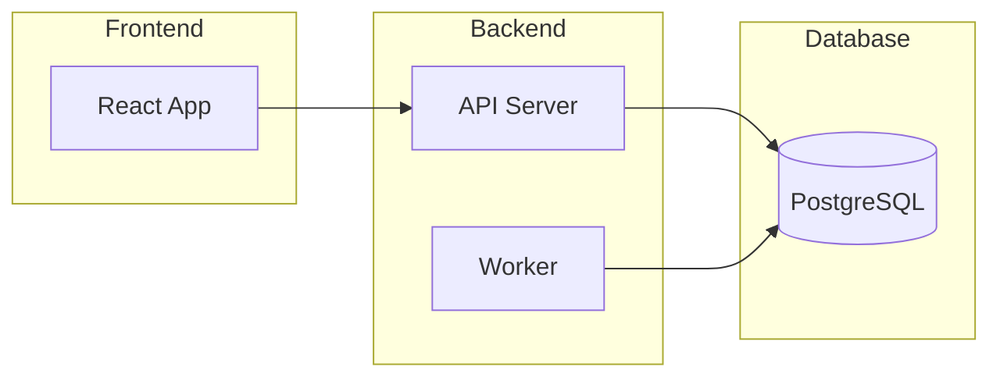
````

**PlantUML:**

````markdown
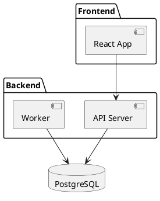
````

## アスキーアート図の扱い

design.mdにアスキーアートで書かれた図がある場合:

```
┌─────────────┐
│   Client    │
└──────┬──────┘
       │
       ↓
┌─────────────┐
│   Server    │
└─────────────┘
```

→ PlantUMLに変換:

````markdown
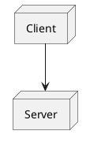
````

## 変換しない要素

以下はMarkdownのまま維持:

- `# 見出し`
- `**太字**`, `*斜体*`
- `- リスト`, `1. 番号リスト`
- `| テーブル |`
- `` `インラインコード` ``
- ` ```コードブロック``` `
- `[リンク](url)`
- `> 引用`
- `---` 水平線

## 注意事項

1. **PlantUMLマクロ必須**: ConfluenceにPlantUMLマクロがインストールされている必要がある
2. **複雑な図**: 自動変換が難しい場合は手動調整が必要
3. **プレビュー確認**: 変換後はConfluenceでプレビュー確認を推奨
