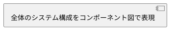
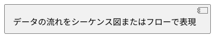
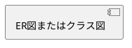
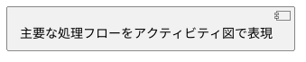
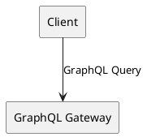

# Confluence出力フォーマット

ユーザーフレンドリーで設計がわかりやすくまとまった形式で出力する。

## 出力構成

design.mdの内容を以下の構成に再編成して出力:

````markdown
# {機能名} 技術設計書

## 📋 概要

### この機能について

[1-2文で機能の目的を説明]

### 対象ユーザー

- [誰がこの機能を使うか]

### 主な変更点

- [変更点1]
- [変更点2]

---

## 🏗️ アーキテクチャ

### システム構成図


````

### データフロー



---

## 📊 データ設計

### データモデル



### 主要なデータ構造

| 項目 | 型  | 説明 |
| ---- | --- | ---- |
| ...  | ... | ...  |

---

## 🔄 処理フロー

### メインフロー



### 条件分岐・エッジケース

| ケース  | 条件 | 処理 |
| ------- | ---- | ---- |
| 正常系  | ...  | ...  |
| 異常系1 | ...  | ...  |

---

## 🔌 API設計

### エンドポイント一覧

| メソッド | パス     | 説明 |
| -------- | -------- | ---- |
| GET      | /api/xxx | ...  |
| POST     | /api/xxx | ...  |

### リクエスト/レスポンス例

```json
// Request
{
  "field": "value"
}

// Response
{
  "result": "success"
}
```

---

## ⚠️ 注意事項・制約

### 技術的制約

- [制約1]
- [制約2]

### 依存関係

- [外部サービスA]
- [ライブラリB]

---

## 📝 補足情報

### 関連ドキュメント

- [リンク1]
- [リンク2]

### 変更履歴

| 日付       | 内容     |
| ---------- | -------- |
| YYYY-MM-DD | 初版作成 |

````

## 整形ルール

### 1. 見出しにアイコンを付与

視認性を高めるため、主要セクションにはアイコンを付ける:

| セクション | アイコン |
|-----------|---------|
| 概要 | 📋 |
| アーキテクチャ | 🏗️ |
| データ設計 | 📊 |
| 処理フロー | 🔄 |
| API設計 | 🔌 |
| 注意事項 | ⚠️ |
| 補足情報 | 📝 |
| テスト | 🧪 |
| セキュリティ | 🔒 |

### 2. セクション区切り

主要セクション間には `---` で区切りを入れる。

### 3. 図を積極的に使用

以下の場面では必ず図を含める:

| 場面 | 推奨図 |
|------|--------|
| システム全体像 | コンポーネント図 |
| 処理の流れ | シーケンス図、アクティビティ図 |
| データ構造 | ER図、クラス図 |
| 状態遷移 | ステートマシン図 |
| 条件分岐 | フローチャート |

### 4. テーブルで整理

箇条書きが長くなる場合はテーブルで整理:

**NG:**
```markdown
- フィールドA: 文字列、必須、ユーザー名を格納
- フィールドB: 数値、任意、年齢を格納
````

**OK:**

```markdown
| フィールド | 型     | 必須 | 説明       |
| ---------- | ------ | ---- | ---------- |
| A          | 文字列 | ✓    | ユーザー名 |
| B          | 数値   | -    | 年齢       |
```

### 5. コードブロックは言語指定＆複数行はブロックで

**IMPORTANT**: 数行のコード・パス・コマンド等は必ずコードブロック（` ``` `）でまとめること。一行一行をインラインコード（`` ` ``）で書かない。

**NG:**
```markdown
- `const a = 1;`
- `const b = 2;`
- `const c = a + b;`
```

**OK:**
```markdown
```typescript
const a = 1;
const b = 2;
const c = a + b;
```
```

コードブロックには言語指定を付ける:

```typescript
// Good: 言語指定あり
const x = 1;
```

### 6. 概要は最初に

技術詳細の前に、必ず「何をするか」「誰のためか」を明記。

### 7. 冗長な説明を避ける

- 同じ内容を繰り返さない
- 図で表現できることは図で
- 箇条書きは簡潔に

## design.mdからの変換指針

| design.mdのセクション | confluence.mdでの配置       |
| --------------------- | --------------------------- |
| 概要・目的            | 📋 概要                     |
| システム構成図        | 🏗️ アーキテクチャ           |
| データフロー          | 🏗️ アーキテクチャ           |
| 型定義・スキーマ      | 📊 データ設計               |
| 処理ロジック          | 🔄 処理フロー               |
| API/GraphQL           | 🔌 API設計                  |
| エラーハンドリング    | ⚠️ 注意事項                 |
| テスト戦略            | 🧪 テスト（追加セクション） |

## 出力例

design.mdに以下がある場合:

```markdown
## 2. アーキテクチャ

### 2.1 システム構成図

┌─────────────┐
│ Client │
└──────┬──────┘
│ GraphQL Query
↓
┌─────────────────────────────────────────────┐
│ GraphQL Gateway │
└──────┬──────────────────────────────────────┘
```

→ confluence.mdでは:

````markdown
## 🏗️ アーキテクチャ

### システム構成図


````

クライアントからGraphQL Gatewayを経由してデータを取得する構成です。

```

```
