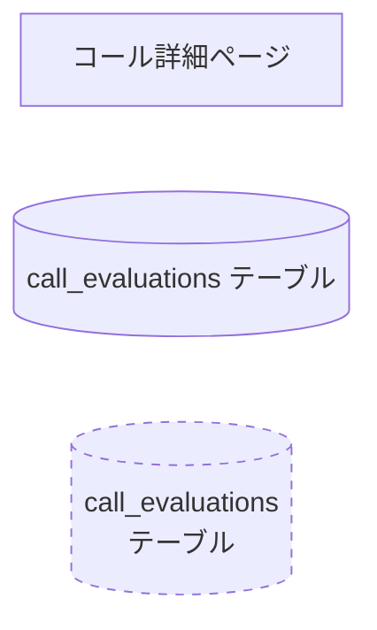

# ブランチ状態図・処理フロー図生成スキル

## 概要

ブランチの変更内容を分析し、**10年後の新人エンジニアが処理の全体像を把握できるレベル**の
Mermaid状態図・処理フロー図を自動生成する。

**CRITICAL品質基準**: ドメイン知識ゼロの人間がこのドキュメントだけ読んで「何が起きているか」「なぜそうなっているか」を完全に理解できること。専門用語は必ず用語集で定義し、暗黙の前提は補足noteで説明する。

## 実行タイミング

- Phase 5（完了報告）の一部として自動実行
- ワークフロー/バッチ処理/状態管理/外部連携を含む変更では**必須**
- ユーザーが明示的に `/generate-state-diagram` で呼び出す場合

## スキップ条件

- UIのみの変更（スタイル修正、テキスト変更等）
- テストコードのみの変更
- 設定ファイル/ドキュメントのみの変更
- 単一関数の修正（状態遷移を伴わない）

## 実行手順

### Step 1: 変更内容の把握

```bash
git diff <BASE_BRANCH>...HEAD --stat
git log <BASE_BRANCH>..HEAD --oneline
```

ブランチの全体像を取得。

### Step 2: Exploreサブエージェントで深掘り調査

変更ファイルの中から以下を重点的に調査:
- ワークフロー/オーケストレーション層（Temporal, cron, queue等）
- 状態を持つエンティティ（DBテーブル, ステータスカラム）
- 外部システム連携（API呼び出し, Webhook）
- UIの状態管理（フィルタ, ページネーション, 表示切替）
- 条件分岐・エラーハンドリング
- ファイル間の呼び出し関係

### Step 3: 図の構成を決定

変更の性質に応じて必要な図を選択（全て必須ではない）:

| 図の種類 | 使用条件 | Mermaid種別 |
|---------|---------|-------------|
| 全体フロー | 常時（メイン図） | stateDiagram-v2 |
| 状態遷移 | ステータスカラムがある場合 | stateDiagram-v2 |
| 条件分岐 | 重要な分岐ロジックがある場合 | stateDiagram-v2 (choice) |
| データフロー | 外部システム連携がある場合 | flowchart LR |
| シーケンス | 複数システム間の時系列やり取り | sequenceDiagram |

### Mermaid構文の注意事項（CRITICAL）

**stateDiagram-v2で日本語state名を使う場合、自己参照サイクルエラーを防ぐため以下を厳守する。**

#### ルール1: state名は英語IDで定義し、ラベルで日本語を表示する

```mermaid
%% ✅ 正しい: 英語ID + 日本語ラベル + noteはID参照
state "トリガー" as trigger
note right of trigger
    説明テキスト
end note

%% ❌ NG: 日本語state名をそのままnoteターゲットに使う → サイクルエラー
state トリガー {
    note right of トリガー
        説明テキスト
    end note
}
```

#### ルール2: stateブロック内でそのstate自身の名前をnoteターゲットにしない

```mermaid
%% ✅ 正しい: ブロック外でnoteを付ける
state "評価基準取得" as criteria_fetch {
    [*] --> dept_search
}
note right of criteria_fetch
    説明テキスト
end note

%% ✅ 正しい: ブロック内の子stateにnoteを付ける
state "評価基準取得" as criteria_fetch {
    state "部署基準検索" as dept_search
    note right of dept_search
        子stateへの説明
    end note
}

%% ❌ NG: ブロック内で親stateと同名のターゲット → サイクルエラー
state 基準取得 {
    note right of 基準取得
        説明テキスト
    end note
}
```

#### ルール3: flowchartではノードIDに日本語を使わず角括弧内に記載する



### Step 4: 各図の生成

#### 全体フロー（必須）
- トリガー（何がこの処理を開始するか）を明示
- 各ステップ（並列実行はfork/joinで表現）
- 最終結果（どこに保存/通知されるか）
- **重要**: 各ステップに「何をしているか」だけでなく「なぜ必要か」のnoteを付与

#### 状態遷移（ステータスがある場合）
- 各状態の定義とnoteでの説明
- 遷移条件を矢印ラベルに明記
- 初期状態と、各状態に至る条件
- **重要**: 「この状態になるとユーザーからはどう見えるか」をnoteで補足

#### 条件分岐（重要な分岐がある場合）
- choiceノードで分岐を表現
- 各分岐先の処理内容
- **重要**: 分岐の背景・ビジネス理由をnoteで補足（「なぜこの条件で分岐するのか」）

#### データフロー（外部連携がある場合）
- subgraphで各システムをグループ化
- データの流れを矢印で表現
- 点線矢印で間接的な参照を表現

### Step 5: 補足情報の追加

#### 用語集（CRITICAL・必須）

**10年後の新人が読む最重要セクション**。変更で登場する全てのドメイン用語・技術用語をテーブルで定義する。

基準:
- 社内独自の略語・用語は必ず含める
- 一般的な技術用語でもプロジェクト固有の意味がある場合は含める
- 「この用語を知らない人が読んだら困るか？」→ YESなら含める

#### ファイル構成マップ（必須）

変更ファイルを論理的にグループ化したツリー表示。
各ファイルの役割を1行コメント（← 〇〇）で付記。

#### ビジネスロジック詳細（重要なものがあれば）

判定ロジック、分類定義、計算式、マッピングテーブルなど。
コードを読まなくても理解できるレベルの説明を記載。

### Step 6: 出力

メモリディレクトリの `91_state_diagram.md` に保存。

## 出力テンプレート

```markdown
# [機能名] — 状態図・処理フロー

> **ブランチ**: `<ブランチ名>`
> **作成日**: <日付>
> **目的**: 10年後の新人がこの機能の全体像を把握できるドキュメント

---

## 1. システム概要

（3-5行で機能の目的を説明。ビジネス的な背景も含める）

---

## 2. 全体フロー（メイン状態図）

（Mermaid stateDiagram-v2。noteで各ステップの意図を補足）

---

## 3. 状態遷移（該当する場合）

（Mermaid stateDiagram-v2。各状態の意味とユーザーへの見え方をnoteで補足）

---

## N. 用語集

| 用語 | 説明 |
|------|------|
| （専門用語） | （新人が読んで理解できる説明） |

---

## N+1. ファイル構成マップ

（ツリー表示 + 1行コメント）
```

## 出力の品質基準（CRITICAL）

- **10年後の新人基準（最重要）**: ドメイン知識がなくても「何が起きているか」「なぜそうなっているか」を完全に理解できる。暗黙の前提は全てnoteか本文で説明する
- **「なぜ」の説明**: 処理内容（WHAT）だけでなく、背景・理由（WHY）を必ず含める。例: 「Phase1対象ユーザーのみに制限」→ noteで「PoC期間中のため段階展開」と補足
- **具体性**: 抽象的な「データ処理」ではなく「7シグナル+IS判定の構造化出力」のように具体的に
- **用語集の充実**: 社内用語・略語・ドメイン固有の概念は全て用語集で定義
- **Mermaid互換**: GitHub/VSCode/Notionでそのままレンダリング可能
- **既存機能との区別**: このブランチの新規追加と既存機能を明確に区別する
- **エラーケース・例外の記載**: 正常系だけでなく、失敗時の動作も図に含める
